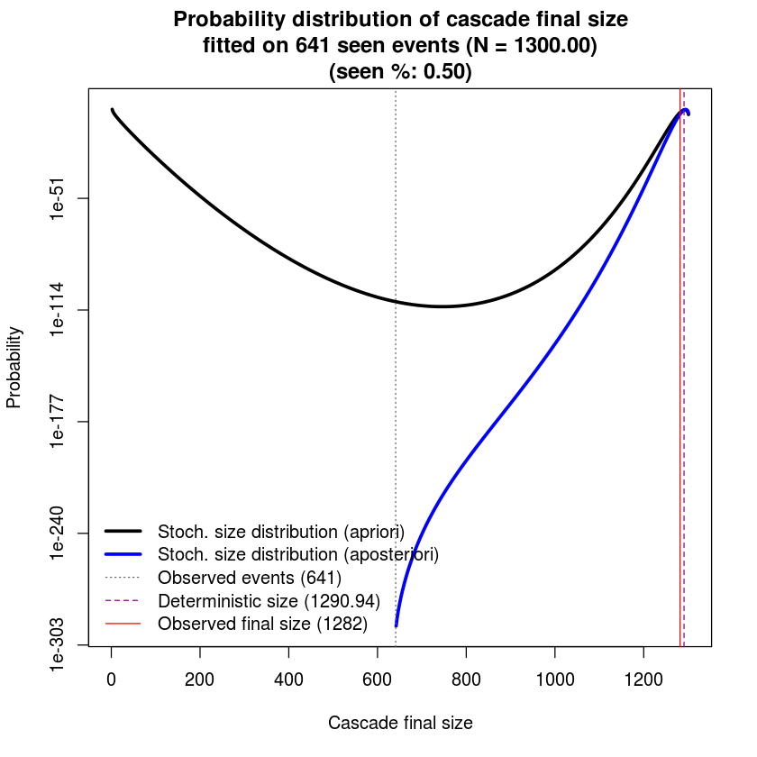

# SIR-Hawkes: Linking Epidemic Models and Hawkes Processes to Model Diffusions in Finite Populations
This repository contains:
 - Scripts for SIR-Hawkes project: simulation, modeling with SIR and HawkesN.
 - Three datasets consist of tweet cascades.
 - A hands-on tutorial to walk you through some main components of the project: simulation, modeling and population size distribution.

### Citation
The project was introduced in this [paper](https://arxiv.org/abs/1711.01679):
```
Marian-Andrei Rizoiu, Swapnil Mishra, Quyu Kong, Mark Carman, Lexing Xie. 2018. SIR-Hawkes: 
Linking Epidemic Models and Hawkes Processes to Model Diffusions in Finite Populations. . 
In WWW 2018: The 2018 Web Conference, April 23–27, 2018, Lyon, France. ACM, New York, NY, 
USA, 10 pages. https://doi.org/10.1145/3178876.3186108
```
### License
Both dataset and code are distributed under the Creative Commons Attribution-NonCommercial 4.0 International (CC BY-NC 4.0) license, a copy of which can be obtained following this link. If you require a different license, please contact us at Marian-Andrei@rizoiu.eu or Lexing.Xie@anu.edu.au.

# SIR-Hawkes tutorial

### required packages:
    - nloptr
    - parallel
    - data.table

### 1. Preliminary
We need to first load all required packages for simulation and modeling cascades.


```R
library(parallel)
source('scripts/functions-SIR-HawkesN.R')
source('scripts/functions-size-distribution.R')
```

### 2. Stochachastic R simulation
We then simulate 20 stochastic SIR realizations. In this step, we chose a set of parameters ($N = 1300, I_0 = 300, \gamma = 0.2, \beta = 1$) for simulation. Given those simulated events, we are going to fit them with both `SIR` model and our proposed `HawkesN` model to see their modeling performance.


```R
params.S <- c(N = 1300, I.0 = 300, gamma = 0.2, beta = 1)
nsim <- 20
simdat <- replicate(
    n = nsim,
    generate.stochastic.sir(params = params.S, Tmax = 11, hide.output = T)    
)
```

Let's take a look at the simulated data (only the first 20 events of the first simulation were shown).

One simulation is identified as four components:
    - relative times
    - susceptible population size at each time
    - infected population size at each time
    - recovered population size at each time


```R
as.data.frame(simdat[,1])[1:20,]
```


<table>
<thead><tr><th scope=col>time</th><th scope=col>S</th><th scope=col>I</th><th scope=col>R</th><th scope=col>C</th></tr></thead>
<tbody>
	<tr><td>0.000000000</td><td>1000       </td><td>300        </td><td>0          </td><td>300        </td></tr>
	<tr><td>0.001861149</td><td> 999       </td><td>301        </td><td>0          </td><td>301        </td></tr>
	<tr><td>0.002054043</td><td> 998       </td><td>302        </td><td>0          </td><td>302        </td></tr>
	<tr><td>0.002297054</td><td> 997       </td><td>303        </td><td>0          </td><td>303        </td></tr>
	<tr><td>0.003679539</td><td> 996       </td><td>304        </td><td>0          </td><td>304        </td></tr>
	<tr><td>0.005308822</td><td> 995       </td><td>305        </td><td>0          </td><td>305        </td></tr>
	<tr><td>0.010011856</td><td> 995       </td><td>304        </td><td>1          </td><td>305        </td></tr>
	<tr><td>0.013833165</td><td> 995       </td><td>303        </td><td>2          </td><td>305        </td></tr>
	<tr><td>0.015425608</td><td> 994       </td><td>304        </td><td>2          </td><td>306        </td></tr>
	<tr><td>0.018386120</td><td> 993       </td><td>305        </td><td>2          </td><td>307        </td></tr>
	<tr><td>0.018890458</td><td> 992       </td><td>306        </td><td>2          </td><td>308        </td></tr>
	<tr><td>0.019177649</td><td> 992       </td><td>305        </td><td>3          </td><td>308        </td></tr>
	<tr><td>0.032191757</td><td> 991       </td><td>306        </td><td>3          </td><td>309        </td></tr>
	<tr><td>0.035561494</td><td> 990       </td><td>307        </td><td>3          </td><td>310        </td></tr>
	<tr><td>0.037340979</td><td> 989       </td><td>308        </td><td>3          </td><td>311        </td></tr>
	<tr><td>0.038834789</td><td> 988       </td><td>309        </td><td>3          </td><td>312        </td></tr>
	<tr><td>0.041421224</td><td> 987       </td><td>310        </td><td>3          </td><td>313        </td></tr>
	<tr><td>0.041912680</td><td> 986       </td><td>311        </td><td>3          </td><td>314        </td></tr>
	<tr><td>0.043324751</td><td> 985       </td><td>312        </td><td>3          </td><td>315        </td></tr>
	<tr><td>0.051393662</td><td> 984       </td><td>313        </td><td>3          </td><td>316        </td></tr>
</tbody>
</table>


### 3. Fit Stochastic SIR on simulated cascades
We fit stochastic SIR in the following steps:
 - Choose a starting point for all parameters.
 - Apply LBFGS algorithm for optimizing the likelihood function of `SIR` model (This step might take quite a lot of time).


```R
# initial fitting point for each execution
params.fit.start <- c(N = 0.1, I.0 = 0.1, gamma = 0.1, beta = 0.1)

.cl <- makeCluster(spec = min(nsim, detectCores()), type = 'FORK')
results <- parSapply(cl = .cl, X = 1:nsim, FUN = function(i) {
    mysim <- as.data.frame(simdat[, i])
    return(fit.stochastic.sir(mysim, params.fit.start))
})
stopCluster(.cl)

# reconstruct result data format
res <- as.data.frame(results[1,])
names(res) <- 1:nsim             
res <- as.data.frame(t(res))     
res$ll <- unlist(results[2,])
complete_res <- res
```

In the following block, we show how well parameters were retreived by our fitting process. Generally, the median values are closed to the theoretical values with a small standard deviation.


```R
# let's see how well parameters were retreived
prnt <- rbind(params.S[c('N', 'I.0', 'gamma', 'beta')], 
              apply(X = complete_res[, c('N', 'I.0', 'gamma', 'beta')], MARGIN = 2, FUN = median),
              apply(X = complete_res[, c('N', 'I.0', 'gamma', 'beta')], MARGIN = 2, FUN = sd))
rownames(prnt) <- c('theoretical', 'median', 'sd')
print(prnt[, c('N', 'I.0', 'gamma', 'beta')], digits = 2)
```

                     N I.0 gamma  beta
    theoretical 1300.0 300 0.200 1.000
    median      1283.5 300 0.200 0.986
    sd             3.6   0 0.006 0.026


### 4. Fit HawkesN on simulated cascades

We need first to pull out the infective events for HawkesN model.


```R
# get the means at given time points, to be able to compare to deterministic
simhistory <- sapply(X = 1:nsim, FUN = function(i) {
  history.S <- SIR2HAWKES.stochastic.event.series(state = simdat[,i])  
})
```

We model HawkesN on the simulated data following same steps as modeling SIR:
 - Choose a starting point for all parameters.
 - Apply LBFGS algorithm for optimizing the likelihood function of `HawkesN` model (This step might take quite a lot of time).


```R
# start point 
params.fit.start <- c(K = 1, c = 0.1, theta = 0.1, N = 1000)

# fit the event series with HawkesN
.cl <- makeCluster(spec = min(20, detectCores()), type = 'FORK')
results <- parSapply(cl = .cl, X = 1:nsim, FUN = function(i) {
  history.S <- as.data.frame(simhistory[,i])
  fitted.model <- fitSeries(history = history.S, params.fit.start)
})
stopCluster(.cl)
res <- as.data.frame(results['par',])
names(res) <- 1:nsim
res <- data.frame(t(res))
```

We compare the fitted `HawkesN` parameters with theoretical `HawkesN` parameters.


```R
# these are the theoretical parameters
params.H <- c(K = 5, c = 0.001, theta = 0.2, N = 1300)

prnt <- rbind(params.H, 
              apply(X = res, MARGIN = 2, FUN = median, na.rm = T),
              apply(X = res, MARGIN = 2, FUN = sd, na.rm = T))
rownames(prnt) <- c('theoretical', 'median', 'sd')
print(prnt[, c('K', 'theta', 'c', 'N')], digits = 2)

```

                  K theta     c    N
    theoretical 5.0  0.20 0.001 1300
    median      5.5  0.18 0.100 1292
    sd          2.1  8.52 0.000   11


We then compare the fitted `HawkesN` parameters with theoretical `SIR` parameters.
Theorem 3.1 in our paper reveals the link between `HawkesN` and `SIR` models that:

Suppose the new infections in a stochastic SIR process of parameters $\{\beta, \gamma, N\}$
	follow a point process of intensity $\lambda^I(t)$.
	Suppose also the events in a HawkesN process with parameters $\{\mu, \kappa, \theta, N\}$ have the intensity $\lambda^H(t)$.
	Let $\mathcal{T} = \{\tau_1, \tau_2, \ldots\}$ be the set of the times to recovery of the infected individuals in SIR.
	The expectation of $\lambda^I(t)$ over $\mathcal{T}$ is equal $\lambda^H(t)$:
	\begin{equation*} 
		E_\mathcal{T}[ \lambda^I(t)] = \lambda^H(t),
	\end{equation*}
when $\mu = 0$, $\beta = \kappa \theta$, $\gamma = \theta$.

Given this theorem, we are able to convert `HawkesN` parameters into `SIR` parameters and compare them with theoretical `SIR` parameters.


```R
res$gamma <- res$theta
res$beta <- res$K * res$theta
prnt <- rbind(params.S[c('N', 'gamma', 'beta')], 
              apply(X = res[, c('N', 'gamma', 'beta')], MARGIN = 2, FUN = mean, na.rm = T),
              apply(X = res[, c('N', 'gamma', 'beta')], MARGIN = 2, FUN = sd, na.rm = T))
rownames(prnt) <- c('theoretical', 'median', 'sd')
print(prnt[, c('N', 'gamma', 'beta')], digits = 2)
```

                   N gamma beta
    theoretical 1300   0.2  1.0
    median      1295   3.5  6.4
    sd            11   8.5 13.7


### 5. Plotting size distribution
In this section, we will study the probability distribution of population size for a given set of parameters. 


```R
# theoretical parameters shown previously
params.S <- c(N = 1300, I.0 = 300, gamma = 0.2, beta = 1)
params.H <- c(K = 5, c = 0.001, theta = 0.2, N = 1300)
```

Let's calculate the transition matrix and the states mapping matrix for an SIR model with the given parameters.


```R
.transition <- construct.transition.matrix.and.states(params = params.S)
```

Then we construct the event history in required format for HawkesN and we choose the first cascade from our simulated data.


```R
seen_perc <- 0.5
history <- as.data.frame(simhistory[,1])
seenEvents <- round(nrow(history) * seen_perc)
```

Then we get two size distributions for two scenarios:
 - when only 1 event is observed (apriori probability size distribution)
 - when half of events are observed (aposteriori probability size distribution)


```R
# compute size probs at event 1 and current event
size.est.at.zero <- get.size.distribution(params = params.H, .transition = .transition)
size.est.at.end <- get.size.distribution(params = params.H, .transition = .transition, history = history[seq(seenEvents),])
```

We then plot both apriori probability size distribution and aposteriori probability size distribution.


```R
# plot our cascade
matplot(cbind(size.est.at.zero$final.state, size.est.at.end$final.state), 
        col = c('black', 'blue'), type = 'l', log = 'y', lty = c(1, 1), lwd = 3,
        xlab = 'Cascade final size', ylab = 'Probability',
        main = sprintf('Probability distribution of cascade final size\nfitted on %d seen events (N = %.2f)\n(seen %%: %.2f)', 
                       seenEvents, params.H['N'], seen_perc) )
abline(v = seenEvents, lty = 3, col = 'gray40')
abline(v = size.est.at.end$theo.mean, lty = 2, col = 'darkmagenta')
abline(v = nrow(history), lty = 1, col = 'red')
legend('bottomleft', 
        legend = c('Stoch. size distribution (apriori)', 
                   'Stoch. size distribution (aposteriori)',
                   sprintf('Observed events (%d)', seenEvents), 
                   sprintf('Deterministic size (%.2f)', size.est.at.zero$theo.mean), 
                   sprintf('Observed final size (%d)', nrow(history)) ), 
        lty = c(1, 1, 3, 2, 1), lwd = c(3, 3, 1, 1, 1), col = c('black', 'blue', 'gray40', 'darkmagenta', 'red'), bty = 'n')
```

    Warning message in xy.coords(x, y, xlabel, ylabel, log = log):
    “642 y values <= 0 omitted from logarithmic plot”Warning message in xy.coords(x, y, xlabel, ylabel, log):
    “1 y value <= 0 omitted from logarithmic plot”





Several observations (Sec 6.3 in our paper):
 - The apriori probability size distribution shows two maxima. This provides the following explanation for the general perceived unpredictability of online popularity. For cascades showing a bi-modal apriori size distribution, there are two likely outcomes: either it dies out early or it reaches a large size compared to the maximum population $N$. At time $t = 0$ is it impossible to di erentiate between the two outcomes.
 - The aposteriori probability distribution reflects the information gained from the observed events and it shows a single maximum towards the higher size values. The more events we observe, the higher the likelihood of the true value of cascade size.
